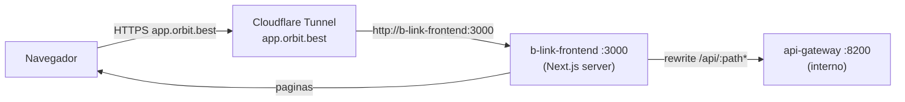

# Handoff: conectar el frontend con el backend (local + `app.orbit.best`)

> Esta parte (dejar la infraestructura lista para que el front y el back se puedan
> conectar en cualquier equipo, en local y detrás del dominio de Cloudflare) ya
> está hecha. **Lo que falta —levantar el túnel, correr los servicios en tu
> máquina y probar la conexión real— es trabajo de quien conecte el proyecto**,
> no algo que se automatizó acá. Esta guía es para que lo hagas sin romper nada.

---

## 1. Qué cambió y por qué

Antes, el frontend llamaba directo al backend con una URL absoluta
(`NEXT_PUBLIC_API_GATEWAY_URL`, ej. `http://api-gateway:8200`). Esa variable es
**pública de Next.js**: queda escrita dentro del JS que se manda al navegador
**en el momento del build**. Eso rompe apenas se sirve el sitio desde otro lugar
(otro equipo, otro dominio, detrás de Cloudflare): el navegador del usuario
final nunca puede resolver `http://api-gateway:8200` porque es un hostname
interno de Docker.

Ahora el navegador **solo le habla al mismo origen** (`/api/...`, sin dominio).
Next.js, corriendo server-side, reenvía esas llamadas al backend real.

**Actualización:** esto originalmente se hacía con `rewrites()` en
`next.config.js`, pero se reemplazó por **Route Handlers** porque los
rewrites de Next.js se resuelven en *build time* y no respetan variables de
entorno leídas en runtime (rompía apenas el contenedor se levantaba con un
`API_GATEWAY_INTERNAL_URL` distinto al del build). Ahora el proxy vive en:

- [`frontend/lib/proxy-server.ts`](frontend/lib/proxy-server.ts) — helper
  `proxyToGateway()` que lee `API_GATEWAY_INTERNAL_URL` en cada request.
- [`frontend/app/api/[...path]/route.ts`](frontend/app/api/%5B...path%5D/route.ts) —
  catch-all para todo `/api/*`.
- [`frontend/app/query/route.ts`](frontend/app/query/route.ts),
  [`frontend/app/inventory/route.ts`](frontend/app/inventory/route.ts),
  [`frontend/app/sospechosos/route.ts`](frontend/app/sospechosos/route.ts) —
  proxies puntuales para los endpoints que no viven bajo `/api/`.

`API_GATEWAY_INTERNAL_URL` es una variable **de servidor** (sin prefijo
`NEXT_PUBLIC_`), así que:

- No queda embebida en el bundle del navegador.
- Se puede cambiar en runtime (docker-compose, `.env`, systemd, lo que sea)
  **sin reconstruir la imagen del frontend**.
- Funciona igual en `localhost` que detrás de `app.orbit.best`: el dominio
  público solo importa para llegar al Next.js server; de ahí para adentro
  siempre es la misma URL interna.



### Archivos que se tocaron para esto

| Archivo | Qué se hizo |
|---|---|
| [`frontend/lib/api.ts`](frontend/lib/api.ts) | **Creado.** No existía; sin este archivo el frontend ni compilaba. `BASE` es relativo por default. |
| [`frontend/next.config.js`](frontend/next.config.js) | Rewrite `/api/:path*` → `API_GATEWAY_INTERNAL_URL`. |
| [`frontend/app/contar/[sesionId]/voz/page.tsx`](frontend/app/contar/%5BsesionId%5D/voz/page.tsx) | Los `fetch` de audio (`/api/audio/transcribir`, `/api/audio/speak`) ya no usan una URL absoluta, ahora son relativos. |
| [`frontend/Dockerfile`](frontend/Dockerfile) | Se quitó el `ARG`/`ENV` de `NEXT_PUBLIC_API_GATEWAY_URL` del build (ya no se usa). |
| [`frontend/.env.local.example`](frontend/.env.local.example) | Refleja las variables nuevas. |
| [`docker-compose.yml`](docker-compose.yml) | El servicio `b-link-frontend` ahora setea `API_GATEWAY_INTERNAL_URL` en vez de `NEXT_PUBLIC_API_GATEWAY_URL`. |
| [`services/api-gateway/main.py`](services/api-gateway/main.py) | Se agregó `GET /api/sesiones` (faltaba; la página `/sesiones` la necesita). |

---

## 2. Cómo correrlo en local (tu equipo)

### Opción A — con Docker Compose (recomendado, es como se despliega)

**Ojo con los profiles.** `openrouter-service` y `elevenlabs-service` NO se
levantan con un `docker compose up -d` a secas — están detrás de profiles
(ver cabecera de [`docker-compose.yml`](docker-compose.yml)). Si tu `.env`
tiene `LLM_BACKEND=openrouter` y/o `STT_BACKEND=elevenlabs` (la config actual
del proyecto), hace falta:

```bash
docker compose --profile with-openrouter --profile with-elevenlabs up -d
```

Si en cambio tu `.env` usa los backends locales (`needle` + `whisper` +
`kokoro`), alcanza con:

```bash
docker compose up -d
```

Esto levanta el frontend en `http://localhost:3000` con
`API_GATEWAY_INTERNAL_URL=http://api-gateway:8200` (nombre del servicio dentro
de la red de Docker). No hay que tocar nada más ahí.

### Opción B — frontend con `npm run dev` (hot reload) + backend en Docker

```bash
# backend
docker compose up -d postgres kalman-worker needle-service api-gateway kokoro-service

# frontend
cd frontend
cp .env.local.example .env.local   # API_GATEWAY_INTERNAL_URL=http://localhost:8200 (default, no hace falta tocarlo)
npm install
npm run dev
```

Abrí `http://localhost:3000`. Las llamadas a `/api/...` las resuelve el rewrite
hacia `http://localhost:8200` (el api-gateway corriendo en Docker, puerto
publicado al host).

**No hace falta setear `NEXT_PUBLIC_API_GATEWAY_URL` en ningún escenario.** Si
la ves puesta en algún `.env`, es un resto viejo — se puede borrar.

---

## 3. Cómo exponerlo en `app.orbit.best` con el túnel de Cloudflare que ya tenés

Como es un solo dominio para todo (frontend + API por el mismo origen), en el
túnel **solo hay que apuntar un hostname**, al frontend (puerto 3000). El
backend (api-gateway, puerto 8200) **no se expone directo a internet**.

En el dashboard de Cloudflare Zero Trust (o en el `config.yml` de tu
`cloudflared`), la ruta pública queda:

| Hostname público | Servicio destino |
|---|---|
| `app.orbit.best` | `http://localhost:3000` (si `cloudflared` corre en el mismo host que Docker) |

Si en cambio corrés `cloudflared` como otro contenedor dentro de la misma red
de Docker (`cactus_net`), el destino sería `http://b-link-frontend:3000` en vez
de `localhost`.

Con eso ya alcanza: cualquiera que entre a `https://app.orbit.best` va a poder
usar la app completa (páginas + audio + todo lo que llame a `/api/...`), sin
tocar CORS ni exponer el api-gateway.

---

## 4. Qué NO romper (checklist antes de tocar esto de nuevo)

- **No reintroduzcas `NEXT_PUBLIC_API_GATEWAY_URL` con una URL absoluta** en
  ningún `fetch` o en `lib/api.ts`. Si necesitás depurar pegándole directo al
  gateway desde el navegador, hacelo aparte (Postman, curl), no cambies el
  código de las páginas.
- **Los `fetch`/`api()` del frontend siempre van con ruta relativa**
  (`/api/algo`), nunca con `http://...` armado a mano. Si agregás una página o
  llamada nueva, seguí ese patrón.
- **`API_GATEWAY_INTERNAL_URL` es solo de servidor.** No le pongas el prefijo
  `NEXT_PUBLIC_` ni la uses en código que corre en el navegador (dentro de
  `"use client"` components) — ahí no existe, siempre va a dar `undefined`.
- **Si cambia dónde vive el backend real** (otro puerto, otro host, otro
  contenedor), lo único que hay que tocar es el valor de
  `API_GATEWAY_INTERNAL_URL` (en `docker-compose.yml` o `.env.local`). No hace
  falta rebuildear la imagen del frontend para esto.
- **Si el túnel de Cloudflare cambia de destino o de hostname**, eso se
  configura del lado de Cloudflare (dashboard o `cloudflared config.yml`), no
  en este repo.
- **`NEXT_PUBLIC_API_KEY` sigue siendo pública** (viaja en el bundle del
  navegador). Es una limitación conocida, ya documentada en
  `frontend/FRONTEND.md`. Si en algún momento se necesita ocultarla del todo
  hay que migrar el rewrite actual a un BFF real (Route Handlers de Next.js),
  no es parte de este arreglo.
- **`/admin` es un link que todavía no tiene página** (no implementado). No es
  un bug de esta conexión, es funcionalidad pendiente aparte.

---

## 5. Cómo saber que quedó bien conectado

1. `docker compose up -d` (o `npm run dev` + backend en Docker).
2. Abrí `http://localhost:3000` → seleccioná una bodega → "Empezar conteo".
   Si carga bodegas y crea la sesión, el proxy `/api/*` está funcionando.
3. Entrá a `/sesiones` → debería listar sesiones (usa el endpoint nuevo
   `GET /api/sesiones`).
4. Probá el modo voz (`/contar/{id}/voz`): grabar, confirmar y que se
   reproduzca el audio de respuesta confirma que el flujo completo
   (STT → registro → narrador → TTS) pasa por el proxy sin problemas.
5. Repetí los mismos pasos en `https://app.orbit.best` una vez armado el
   hostname en Cloudflare — el comportamiento tiene que ser idéntico, sin
   cambiar una línea de código.
